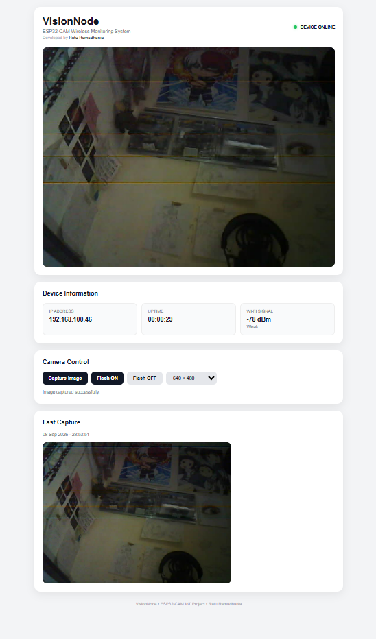

# VisionNode 📷

A lightweight wireless monitoring system built with **ESP32-CAM** and a custom web dashboard.

VisionNode was created as a small IoT project to explore how an ESP32-CAM can be used for real-time monitoring through a local network without requiring an additional application.

## Features

- Real-time camera streaming
- Image capture with preview
- Flash LED control
- Camera resolution control
- Device uptime monitoring
- Wi-Fi signal monitoring
- Local IP information
- Responsive web dashboard

## Hardware

- ESP32-CAM AI Thinker
- USB to TTL / FTDI programmer
- Wi-Fi connection

No additional sensors are required.

## Technologies

- ESP32
- Arduino IDE
- C++
- HTML
- CSS
- JavaScript
- HTTP Web Server

## How It Works

The ESP32-CAM connects to a Wi-Fi network and hosts a local web server.

The dashboard can be accessed through the ESP32-CAM's local IP address and provides live camera streaming, camera controls, device information, and image capture directly from a web browser.

## Preview

## Author

**Ratu Ramadhania**

Informatics Engineering graduate interested in IoT, embedded systems, technology, art, and design.

---

Built as a personal IoT exploration project using ESP32-CAM.
